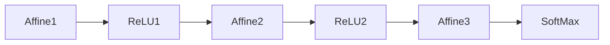
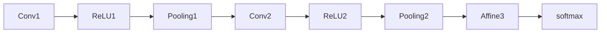

# 들어가며
이 글은 `밑바닥부터 시작하는 딥러닝` 7장 합성곱 신경망(CNN) 의 내용을 정리한 포스팅입니다. 이 포스팅의 내용을 이해하려면 이 책의 이전 장을 알고 있는 게 좋습니다.
아니면, 딥러닝 신경망이 어떻게 구성되는지 대략적으로 알고 계신다면, 내용 이해에 도움이 될 거라고 생각합니다.

# 합성곱 신경망(CNN)
CNN은 **Convolutional neural network**의 약자로, 합성곱 신경망이라는 의미입니다. CNN은 이미지 인식과 음성 인식 등 다양한 곳에서 사용되는데요. 특히 이미지 인식 분야에서 광범위하게 사용되고 있습니다.
이 장에서는 CNN의 메커니즘을 설명할 예정입니다.

## 전체 구조
- CNN도 일반적인 딥러닝과 구조는 같습니다.
    - 즉 어파인 연산 > 활성화 함수(시그모이드 or ReLU) 의 레이여가 연속되어 있는 구조입니다.
    - 다만 합성곱 계층과 풀링 계층이 새롭게 등장합니다.

지금까지 신경망의 구조는 다음과 같았습니다.

CNN 또한 비슷합니다. 다만 새로운 계층이 추가됩니다.

새롭게 합성곱 계층(Conv)와 폴링 계층(Pooling) 이 추가됩니다. 특징은 다음과 같습니다.

- 폴링 계층은 생략될 수도 있다.
- 출력에 가까운 층에서는 Affine - ReLU 레이어를 사용할수도 있다.
- 마지막 출력 계층에서는 Affine - Softmax 조합을 사용할수도 있다.

## 합성곱 계층(Conv)
지금까지 본 완전연결 신경망에서는 Affine 계층을 사용하였습니다. 이 신경망에서는, 인접하는 계층의 뉴런이 모두 연결되고 출력의 수는 임의로 정할 수 있습니다.
이 방식은 문제점이 있습니다. 바로 데이터의 형상이 무시된다는 것입니다.

예를 들면 MNIST 데이터셋은 (1, 28, 28)의 3차원 데이터셋이지만, 데이터를 입력할 때는 위의 픽셀을 일렬로 세운 1 * 28 * 28 = 784개의 데이터를 Affine 계층에 입력했습니다.
이미지는 3차원 형상이며, 픽셀 사이의 관계에도 여러 가지 정보가 담겨 있습니다. 공간적으로 가까운 픽셀은 값이 비슷하다던지, RGB 각 채널은 밀접하게 관련되어 있다던지 하는 데이터입니다.
완전연결 신경망에서는 위의 성질을 무시하게 됩니다. 그러나, 합성곱 계층은 형상을 유지합니다. 이미지도 3차원 데이터로 입력받으며 마찬가지로 다음 계층에도 3차원 데이터로 전달합니다.

합성곱 계층에서 사용하는 용어 정리를 간단하게 하고 넘어가겠습니다. 이 용어는 앞으로 여러 번 나올 예정입니다.

- 특징 맵(feature map) : 합성곱 계층의 입출력 데이터
- 입력 특징 맵(input feature map) : 합성곱 계층의 입력 데이터
- 출력 특징 맵(output feature map) : 합성곱 계층의 출력 데이터

### 합성곱 연산
합성곱 연산은 이미지 처리에서 말하는 필터 연산에 해당합니다. 구체적인 예를 보며 설명하겠습니다.

|  1  |  2  |  3  |  0  |     |
| :-: | :-: | :-: | :-: | --- |
|  0  |  1  |  2  |  3  |     |
|  3  |  0  |  1  |  2  |     |
|  2  |  3  |  0  |  1  |     |

이 데이터와

| 2 | 0 | 1 |                     
|:----:|:----:|:----:|
| 0 | 1 | 2 |                     
| 1 | 0 | 2 |

이 데이터를 합성곱으로 처리한다고 가정하겠습니다. 이 데이터에서 입력 데이터는 가로, 세로 방향의 형상이고 필터 또한 가로 세로 방향의 형상입니다. 이를 (4, 4) 그리고 (3,3) 이라고 표현합니다. 문헌에 따라 필터를 커널이라고 부르기도 합니다.

합성곱 연산은 필터의 윈도우를 일정 간격으로 이동시키면서 수행합니다. 순서는 다음과 같습니다.

1. 필터의 (0, 0) 부분을 입력 데이터의 (0,0) 부분에 겹칩니다.
2. 필터와 겹친 부분 데이터를 대응하는 원소끼리 곱해서, 모두 더합니다. 이 과정을 단일 곱샙 누산이라 합니다.
3. 필터를 일정 거리만큼 우측으로 이동시킵니다. 필터의 우측 끝이 입력 데이터의 마지막과 겹친다면, 다음 라인으로 이동시킵니다.
4. 위의 과정을 필터가 입력 데이터의 마지막 부분에 도달할때까지 반복합니다.

위의 데이터를 가지고 한번 연산을 수행해 보겠습니다. 3번의 일정 거리는 1로 가정하겠습니다.

1. 필터의 좌상단을 입력 데이터의 (0,0)에 겹치고 연산을 수행합니다.
- 1\*2 + 0\*2 + 1\*3 + 0\*0 + 1\*1 + 2\*2 + 1\*3 + 0\*3 + 2\*1 = 15
2. 필터를 우측으로 한 칸 이동시킨 뒤, 대응하는 원소끼리 곱한 후 연산을 수행합니다. 
- 2\*2 + 0\*3 + 1\*0 + 0\*1 + 1\*2 + 2\*3 + 1\*0 + 0\*1 + 2\*2 = 16
3. 필터가 우측 끝에 도달했으므로, 아래로 한칸 이동시킨 뒤 가장 좌측에 붙입니다. 입력 데이터의 (1, 0) 위치입니다.
4. 연산 수행후 우측으로 한 칸 이동시킵니다. 연산을 수행합니다.
5. 필터가 우측 끝 마지막 부분에 도달하였으므로 연산을 종료합니다.

필터연산을 거친 데이터를 나타내면 다음과 같은 모양이 됩니다.

| 15 | 16 |
|:----:|:----:|
| 6  | 15 |

완전연결 신경망에는 편항이 존재하는데, CNN에도 편향이 존재합니다. 연산을 다 수행했다면 편항을 결과값의 모든 원소에 더해줍니다. 만약, 편향이 3이라면 최종 결과값은 다음과 같을 것입니다.

| 18 | 19 |
|:----:|:----:|
| 9  | 18 |

### 패딩
합성곱 연산을 수행하기 전에, 데이터 주변을 특정 값으로 채우기도 합니다. 이를 패딩이라고 하며 합성곱 연산에서는 자주 사용하는 기법입니다.

입력 데이터 주위를 왜 0으로 채울까요? 패딩은 주로 출력 데이터의 크기를 조절할 목적으로 사용합니다. 예를 들어, (4,4)입력 데이터에 (3,3) 필터를 적용하면 출력은 (2,2)가 됩니다. 이는 합성곱 연산을 몇 번 되풀이하는 신경망에서 문제가 될 수 있습니다. 출력 데이터가 1이 되어버릴 테니까요. 이러한 사태를 막기 위해, 패딩을 사용합니다. 패딩 (1,1)을 추가하면 출력 데이터의 폭이 (4,4)가 되기 때문에, 공간적 크기를 고정한 상태로 다음 계층에 전달할 수 있습니다.

### 스트라이드
필터를 적용하는 위치의 간격을 스트라이드라고 합니다.위의 예제에서 필터를 옆으로 움직이는 위치 간격을 1로 잡았는데요. 이 값을 스트라이드라고 합니다. 만약 2로 한다면 필터가 우측으로 두 칸씩 이동할 것입니다.

위의 패딩, 스트라이드, 입력 크기를 가지고 출력 크기를 계산할 수 있습니다. 입력 크기를 (H, W) 필터 크기를 (FH, FW) 출력 크기를 (OH, OW), 패딩을 P 스트라이드를 S라고 하면, 출력 크기는 다음과 같이 계산할 수 있습니다.

$$ OH\quad =\quad \frac { H\quad +\quad 2P\quad -\quad FH }{ S } \quad +\quad 1 $$

$$ OW\quad =\quad \frac { W\quad +\quad 2P\quad -\quad FW }{ S } \quad +\quad 1 $$

위 식의 OH, OW는 정수로 나누어 떨어지는 값이어야 합니다. 출력 크기가 정수가 아니라면 오류를 내는 등의 대응이 필요합니다.

## 폴링 계층
폴링은 가로, 세로 방향의 공간을 줄이는 연산입니다. 예를 들어 설명하겠습니다.

|  1  |  2  |  3  |  0  |     |
| :-: | :-: | :-: | :-: | --- |
|  0  |  1  |  2  |  3  |     |
|  3  |  0  |  1  |  2  |     |
|  2  |  3  |  0  |  1  |     |

이 데이터에서 2*2 영역을 원소 하나로 집약하여 공간 크기를 줄여보겠습니다.

|  1  |  2  |     |
| :-: | :-: | --- |
|  0  |  1  |     |

이 데이터에서 가장 큰 값을 추출합니다. 여기서는 2입니다.
그 다음에 우측 상단의 2*2 영역에서 가장 큰 값을 추출하겠습니다.

| 3 | 0 |                     
|:----:|:----:|
| 2 | 3 |

여기서는 3입니다.
이렇게 각각 영역에서 가장 큰 값을 추출하면, 결과값은 다음과 같게 됩니다.

|  2   |  3   |
|:----:|:----:|
|  4   |  2   |

이를 최대 폴링(max pooling)이라고 합니다. 최대 폴링은 최댓값을 구하는 연산으로, 2\*2는 대상 영역의 크기를 뜻합니다. 즉, 2\*2영역에서 가장 큰 값을 추출합니다. 이 예에서는 스트라이드가 2였으므로 2*2 윈도우가 2칸 간격으로 이동합니다.

폴링의 윈도우 크기와 스트라이드는 같은 값으로 설정하는 것이 일반적입니다. 윈도우가 3\*3 이면 스트라이드는 3으로, 4\*4면 스트라이드는 4로 설정합니다.

다른 종류의 폴링도 있습니다. 

- 평균 폴링 : 대상 영역의 평균을 계산합니다.

이미지 인식 분야에서는 주로 최대 폴링을 사용합니다. 이 포스팅에서 폴링이라고 하면, 최대 폴링을 의미합니다.

### 폴링 계층의 특징

1. 학습해야 할 매개변수가 없다
   - 특별히 학습해야 할 것이 없습니다

2. 채널 수가 변하지 않는다.
   - 입력 데이터의 채널 수 그대로 출력 데이터로 내보냅니다. 만약, 입력 데이터가 3개라면 출력 데이터도 3개가 됩니다.

3. 입력의 변화에 영향을 적게 받는다(강건하다)
   - 입력 데이터가 조금 변해도 폴링의 결과는 잘 변하지 않습니다. 대상 영역의 크기에서 최대값을 추출하기 때문입니다.

## CNN 시각화하기
CNN의 합성곱 필터를 태우면, 데이터는 어떻게 변하는 것일까요? CNN 합성곱 계층을 시각화하여 어떻게 데이터가 변하는지 확인해 보겠습니다.

위의 이미지가 학습 전의 1층의 합성곱 계층의 가중치, 이후 이미지는 학습을 마친 후에 1층의 합성곱 계층의 가중치입니다. 학습 전 필터는 무작위로 초기화되고 있어서, 흑백의 정도에 규칙성이 없습니다. 학습을 마친 후의 필터는 규칙성 있는 이미지가 되었습니다. 흰색에서 검은색으로 변화하는 필터의 덩어리(블롭)가 진 필터 등, 규칙을 띄는 필터로 바뀌었습니다.

규칙성 있는 필터는 에지(색상이 바뀐 경계선)가 블롭(국소적으로 덩어지진 영역)이 뚜렷합니다. 그렇게 구성된 필터에 입력 데이터를 흘리면, 필터의 에지와 블롭에 따라 각각 다른 에지에 반응하게 됩니다. 그렇게 학습을 완료한 필터는 에지나 블롭 등의 원시적인 정보를 추출할 수 있게 됩니다.

### 층 깊이에 따른 추출 정보 변화
앞에서는 합성곱 1층 필터에서는 에지와 블롭 데이터를 추출할 수 있다는 것을 알 수 있었습니다. 그렇다면 겹겹히 쌓인 CNN의 각 계층에서는 어떤 정보를 추출할 수 있을까요? 계층이 깊어질수록 추출되는 정보는 더 추상화된다는 것을 알 수 있었습니다. 

딥러닝의 흥미로운 점은, 합성곱 계층을 여러 겹 쌓으면 층이 깊어지면서 더 복잡하고 추상화된 정보를 추출할 수 있다는 것입니다. 처음 층은 에지에 반응하고, 두번째 층은 텍스처에 반응하고, 더 복잡한 사물의 일부에 반응하도록 변화합니다. 즉, 뉴런이 반응하는 대상이 단순한 모양에서 고급 정보로 변화합니다. 사물의 의미를 이해하도록 변화하는 것입니다.