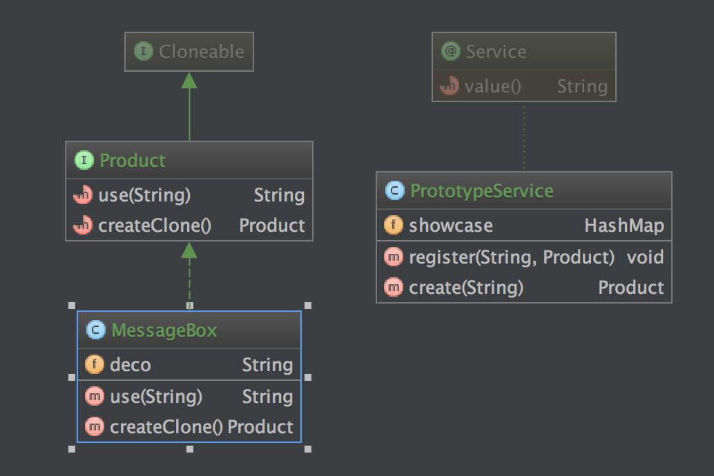

# 들어가며
이 포스팅의 내용은 `Java 언어로 배우는 디자인 패턴` 5장 Prototype 패턴을 정리한 것입니다. 여기 나오는 코드는 JDK 1.8에서 작성, 테스트 되었습니다.
이 포스팅에 있는 코드는 [여기](https://github.com/astrod/design-pattern/tree/master/src/main/java/pattern/JU/prototype) 서 확인하실 수 있습니다.
코드 또한 책에서 예제로 나온 코드를 조금 변경한 것입니다.

# Prototype 패턴
무언가의 인스턴스를 만들 때는 다음 코드를 사용합니다.

~~~java
Something a = new Something();
~~~

그러나, 클래스 이름을 지정하지 않고 인스턴스를 생성할 때도 있습니다. 다음과 같은 경우에는 인스턴스를 만드는 것이 아니라 인스턴스를 복사하여 새로운 인스턴스를 만듭니다.

1. 종류가 너무 많이 클래스로 정리되지 않는 경우
	- 취급하는 오브젝트의 종류가 너무 많아, 각각을 별도의 클래스로 만들어 다수의 소스 파일을 작성해야 함
2. 클래스로부터 인스턴스 생성이 어려운 경우
	- 생성하고 싶은 인스턴스가 복잡한 작업을 거쳐 만들어지기 때문에, 클래스로부터 만들기가 매우 어려운 경우
3. framework와 생성할 인스턴스를 분리하고 싶은 경우
	- 프레임워크를 특정 클래스에 의존하지 않고 만들고 싶은 경우. 클래스 이름을 지정하여 인스턴스를 만드는 것이 아니라, 이미 모형이 되는 인스턴스를 등록해 두고, 그 인스턴스를 복사하여 생성한다.

이러한 경우 사용하는 패턴이 프로토타입 패턴입니다. 프로토타입 패턴은 인스턴스를 생성하는 것이 아니라, 원형이 되는 인스턴스를 복제하여 인스턴스를 생성하게 됩니다.

## 예제 프로그램
다음 프로그램을 확인해 봅시다. 다음 프로그램은 문자열의 앞뒤를 * 혹은 _로 감싸는 프로그램입니다. 즉, 인풋으로 TEST가 들어온다면 아웃풋으로는 \_TEST\_ 혹은 \*TEST\* 를 출력합니다.

예제 프로그램의 다이어그램과, 인터페이스의 종류는 다음과 같습니다.

- Product : 추상 메소드 use와 createClone이 선언되어 있는 인터페이스
	- use : 메서드가 해당하는 동작(앞뒤를 입력받은 문자로 감싼다)을 수행하게 하는 인터페이스
	- createClone : 자기 자신을 복사하여 새로운 인스턴스를 리턴하는 메소드
- PrototypeService : 복사할 객체를 등록하는 register와 입력받은 객체를 복사하여 생성하는 create 메서드가 있는 서비스
	- register : 복사할 객체를 등록한다. key는 객체의 다운캐스팅한 클래스 이름으로 한다.
	- create : 등록되어 있는 객체에서 클래스명으로 해당하는 객체를 복사한다.
- MessageBox : Product를 구현한 클래스

각각 클래스에 대해 좀 더 자세하게 아래에서 설명하겠습니다.

## Product
자바에서는 객체를 복사하기 위해서 Cloneable 클래스를 구현하여야 합니다. Product 객체를 구현한 구현체를 복사할 것이기 때문에, Product 인터페이스에서는 Cloneable 을 extends 하여야 합니다.
코드는 다음과 같습니다.

~~~java
public interface Product extends Cloneable {
	Map<String, String> maps = new HashMap<>(); // 나중에 깊은복사 - 얕은복사 확인하기 위해 추가

	String use(String s);
	Product createClone();
}
~~~ 

## PrototypeService
복사할 객체를 등록하고, 입력받은 키로 객체를 복사하여 반환하는 역할을 하는 객체입니다. 내부에는 showcase라는 HashMap이 있고, 인스턴스를 이름으로 저장합니다.

코드에서 객체의 실제 이름이 나오지 않음을 주의해서 보면 좋습니다. 내부에서 클래스의 이름이 노출되지 않기 때문에, 이 객체는 Product의 구현체와 별개로 독립적으로 수정할 수 있습니다. Product라는 인터페이스만이 실제 구현체와 징검다리 역할을 합니다.

코드는 다음과 같습니다.

~~~java
@Service
public class PrototypeService {
	private HashMap showcase = new HashMap<>();

	public void register(String name, Product proto) {
		showcase.put(name, proto);
	}

	public Product create(String protoName) {
		return ((Product)showcase.get(protoName)).createClone();
	}
}
~~~

## MessageBox
이 클래스는 Product 인터페이스의 구현체입니다. 코드는 다음과 같습니다.

~~~java
public class MessageBox implements Product {
	private String deco;

	public MessageBox(String deco) {
		this.deco = deco;
	}

	@Override
	public String use(String s) {
		return deco + s + deco;
	}

	@Override
	public Product createClone() {
		Product p = null;
		try {
			p = (Product)clone();
		} catch (CloneNotSupportedException ex) {
			ex.printStackTrace();
		}
		return p;
	}
}
~~~

## Clone
자바에서 `Clone`은 Cloneable 클래스를 상속한 클래스에서 clone() 메서드를 호출하여 구현할 수 있습니다. clone이 호출되면 해당 클래스의 인스턴스를 복사해서 반환하게 됩니다.
몇 가지 주의할 점이 있습니다.

1. Cloneable 인터페이스를 상속하지 않은 경우
	- CloneNotSupportedException이 발생하게 됩니다.
2. 클래스 명이 같다.
	- 클래스를 복사하였기 때문에 클래스 명이 같습니다.
3. hashCode() 의 리턴값이 다르다.
	- 아예 다른 객체가 리턴되기 때문에, hashCode()의 리턴값이 다릅니다.
4. 얕은 복사가 이루어진다.
	- 만약에 복사할 객체가 다른 객체를 가지고 있다면, 객체에 대한 참조가 복사되는 것이지 객체 자체가 따로 복사되는 것은 아닙니다. 만약에 객체를 깊은 복사로 완전히 복사할 필요가 있다면, clone 메서드를 오버라이드 하여 재정의해야 할 것입니다.
5. 객체가 생성되는 것이 아니다.
	- 복사만 하는 것이고, 생성자를 따로 호출하는 것은 아닙니다.

이하는 이를 테스트하기 위한 테스트코드입니다.

~~~java
@RunWith(SpringJUnit4ClassRunner.class)
@SpringBootTest(classes = Application.class)
public class PrototypeServiceTest {
	private static final String TEST = "TEST";

	MessageBox starBox = new MessageBox("*");
	MessageBox underlineBox = new MessageBox("_");

	@Autowired
	private PrototypeService prototypeService;

	@Before
	public void before() {
		prototypeService.register("starBox", starBox);
		prototypeService.register("underlineBox", underlineBox);
	}

	@Test
	public void create_messageBox() {
		// given

		// when
		Product result = prototypeService.create("starBox");

		// then
		assertThat(result.use(TEST), is("*TEST*"));
		assertThat(result.getClass().toString(), is(starBox.getClass().toString()));
		assertThat(result.hashCode(), not(starBox.hashCode()));
		assertThat(result.maps.hashCode(), is(starBox.maps.hashCode()));
	}

	@Test
	public void create_underLineBox() {
		// given

		// when
		Product result = prototypeService.create("underlineBox");

		// then
		assertThat(result.use(TEST), is("_TEST_"));
		assertThat(result.getClass().toString(), is(underlineBox.getClass().toString()));
		assertThat(result.hashCode(), not(underlineBox.hashCode()));
		assertThat(result.maps.hashCode(), is(underlineBox.maps.hashCode()));
	}
}
~~~

## 마무리
프로토타입 패턴은 `객체를 복사하는 패턴` 으로, 객체를 복사할 때는 얕은 복사가 필요한지 깊은 복사가 필요한지 주의 깊게 생각하여 사용하여야 합니다.

