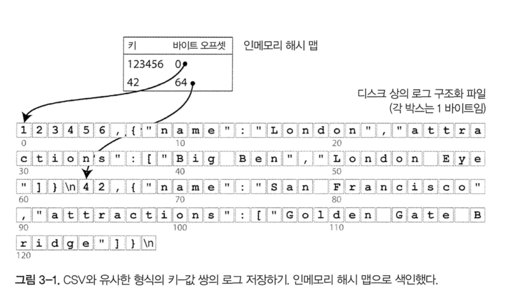
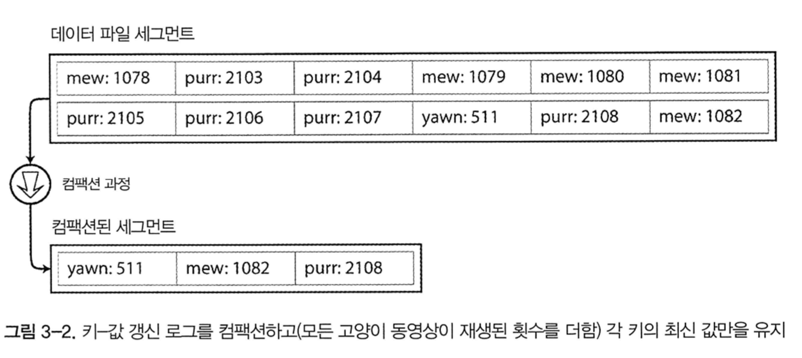
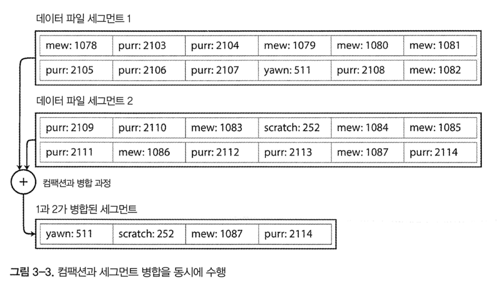
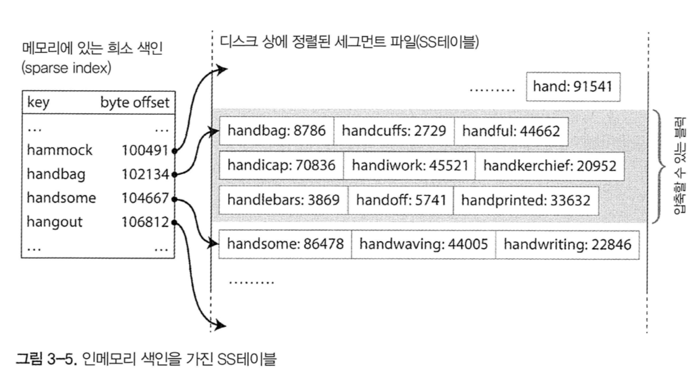

# 저장소와 검색

기본적으로 데이터베이스는 두 가지 작업을 수행한다

1. 데이터를 받으면 데이터를 저장한다.
2. 나중에 그 데이터를 요청하면 데이터를 제공한다.

이번 장에서는 위의 과정을 살펴볼 것이다. 즉, **데이터베이스가 데이터를 저장하는 방법과, 데이터를 요청하였을 때 다시 찾을 수 있는 방법을 설명하려고 한다**

크게 두 가지 파트로 나눠서 설명할 것이다. 관계형 데이터베이스와 NoSQL 의 저장소 엔진에 대해 설명한다. 그 후에 **로그 구조** 계열 저장소와 **페이지 지향** 계열 저장소 엔진을 검토할 것이다.

# 데이터베이스를 강력하게 만드는 데이터 구조

다음과 같은 데이터베이스를 상상해 보자

```bash
#!/bin/bash

db_set() {
    echo " $1,$2 " >> database
}
db_get() {
    grep "^$1," database | sed -e "s/^$1,//" | tail -n 1
}
```

키-값 저장소를 함수 두 개로 구현하였다. 위의 함수를 호출하면 데이터베이스에 key 와 value 를 저장하고 다시 가져올 수 있다. 이 데이터베이스는 다음과 같은 특징을 가지고 있다.

- db_set 을 호출할때마다 파일의 끝에 새로운 데이터를 추가하므로, 키를 갱신하여도 이전 버전에 영향을 미치지 않는다.
- 최신 값을 찾기 위해선 파일의 가장 마지막(tail -n 1) 을 살펴보아야 한다.
- 매번 키를 찾을때마다 파일 전체를 탐색해야 한다. 검색 비용이 $O(n)$ 이다.

검색 성능을 개선하기 위해서는 다른 방법이 필요하다. 즉, 인덱스이다. 인덱스의 일반적인 개념은 **어떤 부가적인 메타데이터를 유지하는 것**이다. 이는 데이터를 검색하는 데 도움을 준다.
그렇기 때문에 거의 대부분의 색인은 쓰기 성능을 하락시킨다. 데이터를 수정 할 때마다 색인 또한 수정하여야 하기 때문이다. 그렇기 때문에, 데이터베이스 관리자나 개발자가 애플리케이션의 질의 패턴을 확인하고, 적당한 색인을 선택하여야 한다.

## 해시 색인

key - value 데이터는 대부분 dictionary type 과 유사하다. 그렇다면 인메모리 데이터 구조를 사용하여 색인을 할 수 있지 않을까?

가장 간단하게 구현할 수 있는 색인 전략은 다음과 같다. 키를 데이터 파일의 바이트 오프셋에 매핑해 인메모리 해시 맵을 유지하는 전략이다. 새로운 key - value 를 추가할 때마다 데이터 오프셋을 갱신하기 위해 해시 맵도 갱신하여야 한다.



이 방식은 각 키의 값이 자주 갱신될 때 적합하다. 그러나 파일에 항상 추가만 하게 되면 결국 디스크 공간이 부족해지게 된다. 이 상황은 어떻게 피할 수 있을까? 특정 크기의 세그먼트로 로그를 나누면 효율적이다. 특정 크기에 도달하면 세그먼트 파일을 닫고 새로운 세그먼트 파일에 이후 쓰기를 수행한다. 그 후에, 세그먼트 파일에 대해 컴팩션을 수행하면 된다. 컴팩션은 로그의 중복된 키를 버리고 각 키의 최신 값만 유지하는 것을 의미한다.



그리고 여러 개의 세그먼트 파일을 동시에 컴팩션 할 수 있는데, 세그먼트는 보통 이뮤터블하므로 컴팩션 작업은 백그라운드 쓰레드에서 진행한다. 컴팩션 중에 요청이 들어오면 이전 세그먼트를 바라보게 하고, 컴팩션이 완료되면 새로 생성된 세그먼트를 바라보게 하면 무중단으로 진행할 수 있다.



이 생각을 구현하려면 세부적으로 많은 사항들을 고려하여야 한다.

- 파일 형식
  - CSV 는 로그에 적합한 형식이 아니다. 바이트 단위의 문자열 길이를 부호화한 다음, 원시 문자열을 부호화하는 바이너리 방식을 사용하는 편이 더 빠르고 간단하다.
- 레코드 삭제
  - 키 삭제시 데이터 파일에 특수한 삭제 레코드를 추가해야 한다. 로그 세그먼트가 병합될 때, 삭제된 키의 이전 값을 무시하고 데이터를 병합한다.
- 크래시 복구
  - 데이터베이스가 재시작되면 인메모리 해시 맵은 손실된다. 원칙적으로는 전체 세그먼트 파일을 읽어 각 키의 오프셋을 확인하여 해시 맵을 다시 생성할 수 있다. 그러나 너무 고통스러운 과정이다. 메모리에 있는 해시 맵 스냅샷을 디스크에 저장하면 복구 속도를 높일 수 있다.
- 부분적으로 레코드 쓰기
  - 로그에 레코드를 추가하는 도중에 데이터베이스가 죽을 수 있다. 체크섬을 포함하여 로그의 손상된 부분을 탐지할 수 있다.
- 동시성 제어
  - 하나의 쓰기 쓰레드만 사용하면 동시성을 유지할 수 있다. 다중 쓰레드로 동시에 읽는 건 상관 없는데, 이는 로그 세그먼트가 이뮤터블하기 때문에 쓰레드 세이프하기 때문이다.

이뮤터블하게 로그를 유지하는 것은 좋은 전략이다. 순차적인 쓰기 작업이기 때문에 무작위 쓰기보다 빠르고, 동시성과 고장 복구가 훨씬 간단해진다. 다만 해시 테이블 또한 제약사항이 있는데, 메모리에 저장해야 하기 때문에 키가 너무 많으면 문제가 된다. 또한 range search 에 효율적이지 않다. 범위 검색 시에도 해시 맵에서 모든 개별 키를 조회하여야 한다.

## SS 테이블과 LSM 트리

위의 해시 테이블에서 간단한 변경 사항 하나를 추가해 보자. 이는 **일련의 key - value 쌍을 키로 정렬하는 것** 이다. 이처럼 키로 정렬된 것을 **Sorted String Table**, 혹은 SS 테이블이라 부른다. 또한 각 키는 각 병합된 세그먼트 파일 안에 한 번만 나타나야 한다. 컴팩션이 수행되면 이 조건은 이미 보장된다. SS 테이블은 해시 테이블 + 로그 세그먼트보다 몇 가지 장점이 있다.

1. 파일이 사용 가능한 메모리보다 크더라도 병합이 간단하다. `mergesort` 알고리즘과 유사한데, 입력 파일을 함께 읽고 각 파일의 첫 번째 키를 본다. 그 후에 가장 낮은 키를 출력파일에 복사한다. 이렇게 하면 새로 만든 세그먼트 파일도 키로 정렬되어 있다.
2. 파일에서 특정 키를 찾기 위해 메모리에 모든 키의 색인을 유지할 필요가 없다.



handiwork 를 찾으려고 한다고 생각해 보자. handbag 과 handsome 의 오프셋을 알고 있고 정렬되어 있으므로 handbag 으로 이동하여 handiwork 가 나올때까지 스캔하면 된다.
일부 키의 오프셋을 유지할 필요가 있지만, 드문드문 인덱스를 생성하여도 된다.

3. 요청 범위 내에서 key - value 를 스캔해야 하기 때문에, 해당 레코드들을 블록으로 그룹화하고 디스크에 쓰기 전에 압축한다. 그러면 인덱스의 각 항목은 압축된 블록의 시작 지점을 가리키게 된다. 압축은 디스크 공간을 절약할 뿐만 아니라, I/O 대역폭 사용도 줄인다.

## SS 테이블 생성과 유지

디스크 상에 키를 정렬하여 유지할 수도 있지만, 메모리에서 하는 것이 훨씬 쉽다. 레드 블랙 트리나 AVL 트리 같은 데이터 구조를 사용하면, 임의 순서로 키를 삽입하고 정렬된 순서로 키를 다시 읽을 수 있다. 이에 저장소 엔진을 다음과 같이 만들 수 있다.

1. 쓰기가 들어오면 **balanced tree** 데이터 구조에 추가한다. 이 인메모리 트리를 **memtable** 이라고 한다.
2. memtable 이 수 메가바이트 정도 임곗값보다 커지면 SS 테이블 파일로 디스크에 기록한다.
3. 읽기 요청이 오면 memtable 에서 키를 찾는다. 그 다음 디스크의 최신 세그먼트에서 찾는다. 이를 반복한다.
4. 병합과 컴팩션을 백그라운드에서 수행한다.

만약 데이터베이스가 고장나면 아직 디스크에 쓰지 않은 memtable 은 손실된다. 이런 문제를 피하기 위해서는 매번 쓸 때마다 분리된 로그를 디스크상에 유지하면 된다. memtable을 SS 테이블로 기록하면 해당 로그는 버리면 된다.

### SS 테이블에서 LSM 트리 만들기

여기에 기술된 알고리즘은 key - value 저장소 엔진 라이브러리에서 사용한다. 이 중에서 카산드라와 Hbase 에서도 유사한 저장소 엔진을 사용한다. 원래 이 색인 구조는 Log-Structured Merge-Tree (또는 LSM 트리) 란 이름으로 발표되었다. 정렬된 파일 병합과 컴팩션 원리를 기반으로 하는 저장소 엔진을 LSM 저장소 엔진이라 부른다.

루씬은 엘라스틱서치나 솔라에서 사용하는 전문 검색 색인 엔진인데, 용어 사전을 저장하기 위해 이와 유사한 방법을 사용한다. 검색 질의로 단어가 들어오며 단어가 언급된 모든 문서를 찾는다. 키를 단어(용어)로, 값은 단어를 포함한 모든 문서의 ID 목록으로 하는 key - value 구조로 구현한다. 루씬에서 용어와 포스팅 목록의 매핑은 SS 테이블과 같은 정렬 파일에 두고, 필요에 따라 백그라운드에서 병합한다.

### 성능 최적화

LSM 트리 알고리즘은 존재하지 않는 키를 찾기 위해서 모든 세그먼트를 다 뒤져야 하는 문제가 있다. 이를 막기 위해, 저장소 엔진은 보통 블룸 필터(Bloom filter) 를 추가적으로 사용한다. 또한 SS 테이블을 압축 / 병합하는 순서와 시기를 결정하는 다양한 전략이 있다. 가장 일반적으로 size-tiered 와 leveled compaction 을 많이 사용한다. Hbase 는 size-tiered 를, 레벨 DB 와 록스 DB 는 leveled compaction 을 사용한다. 카산드라는 둘 다 지원한다.

- size-tiered
  - 상대적으로 좀 더 새롭고 작은 SS 테이블을 상대적으로 오래되었고 큰 SS 테이블에 연이어 병합한다.
- leveled compection
  - 키 범위를 더 작은 SS 테이블로 나누고 오래된 데이터는 개별 레벨로 이동하여, 컴팩션을 점진적으로 진행한다. 이는 디스크 공간을 덜 사용하게 된다.

**LSM 트리의 기본 개념은 백그라운드에서 연쇄적으로 SS 테이블을 지속적으로 병합하는 것이다.** 이 개념은 데이터셋이 가능한 메모리보다 훨씬 더 크더라도 여전히 효과적이고, 데이터가 정렬되어 있기 때문에 range search 를 효율적으로 할 수 있다.

## B Tree

현재 가장 널리 사용되는 인덱스 구조는 B-tree 로 LSM 색인과는 상당히 다르다. 대부분의 관계형 데이터베이스에서 표준 색인 구현으로 B-tree 를 사용하고, 비관계형 데이터베이스에서도 사용한다.

앞에서 살펴본 LSM 색인은 데이터베이스를 수 메가바이트 이상의 가변크기 세그먼트로 나누고, 항상 순차적으로 세그먼트를 기록한다. 반면에 B-tree 는 4kb 크기(혹은 더 큰)의 고정 크기 블록이나 페이지로 나누고, 한 번에 하나의 페이지에 읽기 또는 쓰기를 한다.

각 페이지는 주소나 위치를 이용해 식별할 수 있다. 이 방식으로 하나의 페이지가 다른 페이지를 참조할 수도 있다. 다른 페이지를 참조하여 페이지 트리를 만들 수 있다.

다음과 같은 프로세스를 통해 데이터를 찾는다.

1. 여러 페이지 중 한 페이지를 root 로 지정한다.
2. 루트로부터 child 로 내려가면서 페이지 참조를 통해 하위 페이지로 내려간다.
3. 최종적으로는 leaf page 를 포함하는 페이지에 도달한다. 이 페이지는 각 키의 값이나, 값을 찾을 수 있는 페이지의 참조를 가지고 있다.

한 페이지에서 하위 페이지를 참조하는 개수를 분기 계수(branching factor) 라 부른다. 이 값은 페이지 참조와 범위 경계를 저장할 공간의 크기에 의존적인데, 보통 수백 개에 달한다.

B-tree 의 키값을 갱신하려면, 먼저 키를 포함하고 있는 리프 페이지를 검색하고, 페이지의 값을 바꾼 다음에 페이지를 디스크에 다시 기록한다. 키를 추가하려면 새로운 키를 포함하는 범위의 페이지를 찾아 해당 페이지에 키와 값을 추가한다. 만약 그 페이지에 여유 공간이 없다면, 페이지를 반쯤 채워진 페이지 두개로 찢고, 상위 페이지에 하위 페이지의 범위를 알 수 있게 기록한다.

이 알고리즘은 트리가 계속 balanced 상태임을 보장한다. n 개의 키가 있는 B-tree 는 깊이가 항상 O(logn) 이다. 대부분의 데이터베이스에서 B-tree 의 depth 는 3이나 4 면 충분하므로 검색하려는 페이지를 찾기 위해 많은 페이지 참조를 따라가지 않아도 된다.

### 신뢰할 수 있는 B Tree 만들기

B-tree 에 키를 추가할 때 페이지가 가득차면 페이지를 분할하는 과정을 거치는데, 이는 매우 위험한 동작이다. 이 작업 중에 데이터베이스가 고장난다면 색인이 훼손되고, 고아 페이지(어떤 페이지하고도 연관관계가 없는 페이지)가 발생하기 때문이다. 이를 위해 디스크 상에 쓰기 전 로그(write-ahead log, WAL) 라고 하는 데이터 구조를 추가한다. 트리 페이지에 변경사항을 적용하기 전에 모든 B-tree 의 변경사항을 기록하는 추가 전용 파일이다. 데이터베이스가 고장나면, 복구할 떄 이 파일을 확인하면 된다.

같은 자리의 페이지를 갱신할 때는 주의 깊게 동시성 제어를 해야 한다. 보통 래치(latch) 를 사용하여 트리의 데이터 구조를 보호한다. 이런 상황에서는 LSM 이 훨씬 간단한데, 세그먼트가 이뮤터블하기 때문이다.

### B Tree 최적화

- WAL 유지 대신에 copy-on-write scheme 을 사용하는 경우도 있다. 변경된 페이지는 다른 위치에 기록하고, 트리에 상위 페이지의 새로운 버전을 만들어 새로운 위치를 가리키게 한다.
- 페이지에 키를 축약해 쓰면 공간을 절약할 수 있다. 페이지 하나에 더 많은 키를 채울 수 있다면, 트리의 branching factor 가 높아지기 때문에 depth 가 낮아질 수 있다. (한 페이지는 4kb 를 준수해야 함을 기억하라)
- 트리에 포인터를 추가한다. 각 리프 페이지가 형제 페이지의 참조를 가지고 있다면, 상위 페이지로 가지 않고도 range search 가 가능하다.
- 프렉탈 트리와 같은 B-tree 변형은 디스크 서치를 줄이기 위해 LSM 의 개념을 일부 차용하였다.

## B Tree 와 LSM Tree 비교

LSM 트리 는 쓰기가 빠르고, B-tree 는 읽기가 빠르다. LSM 트리에서 읽기가 느린 이유는, 각 컴팩션 단계에 있는 여러 데이터 구조와 SS 테이블을 확인해야 하기 때문이다. 그러나 벤치마크는 세부 사항에 좌우되는 경우가 많기 때문에, 저장소 엔진의 성능을 측정할 때는 다음 사항을 고려하여야 한다.

### LSM 트리의 장점

- 쓰기가 많은 애플리케이션에서 성능 병목은 데이터베이스가 디스크에 쓰는 속도일 수 있다.

## 기타 색인 구조

지금까지 모두 key - value 색인을 살펴보았다. 대표적인 예는 관계형 DB 의 PK이다. secondary index 를 사용하는 방식도 매우 일반적이다. secondary index 는 쉽게 생성할 수 있다.

### 색인 안에 값 저장하기

인덱스에서 키는 질의의 검색 대상이고, 값은 둘 중 하나, **래퍼런스 혹은 실제 값** 이다. 래퍼런스인 경우에는 로우가 저장된 곳을 **힙 파일** 이라고 하고 데이터를 순서 없이 쌓는다. 힙 파일 접근은 키 변경 없이 값을 갱신하기 편리하다.

인덱스에서 힙 파일을 참조하는 것이 읽기 성능에 불이익이 크기 때문에, 어떤 상황에서는 색인 안에 데이터를 저장하는 경우도 있다. 이를 클러스터드 인덱스라고 한다. MySQL 의 InnoDB 저장소 엔진에서는 테이블의 PK 가 언제나 클러스터드 인덱스이고, 보조 인덱스는 PK 를 참조한다. MSSQL 은 테이블당 하나의 클러스터드 인덱스를 지정할 수 있다.

클러스터드 인덱스(인덱스 안에 데이터 저장)과 비클러스터드 인덱스(인덱스 안에 래퍼런스 저장) 사이의 절충안을 커버링 인덱스라고 한다. 이는 인덱스 안에 컬럼 일부를 저장한다. 이렇게 하면 인덱스만 사용하여 일부 질의에 응답이 가능하다.

모든 종류의 데이터 복제와 마찬가지로, 클러스터드 인덱스와 커버링 인덱스는 읽기 성능을 향상시킬 수 있지만, 추가적인 저장소가 필요하고 쓰기 과정에 오버헤드가 발생한다. 또한 복제로 인한 불일치를 판단할 수 없기 때문에, 데이터베이스는 트랜잭션 보장을 강화하기 위해 노력하여야 한다.

## 다중 컬럼 색인

여러 컬럼에 동시에 질의해야 하는 경우도 있다. 가장 일반적인 인덱스는 결합 인덱스(concatenated index) 이다. 하나의 컬럼에 다른 컬럼을 추가하는 방식으로 하나의 키에 여러 필드를 단순히 결합하는 인덱스이다. 이는 (성, 이름) 을 키로 전화번호를 값으로 하는 종이 전화번호부와 유사하다. 순서가 정렬되어 있기 때문에 특정 성을 가진 사람을 찾거나, 특정 성/이름 조합을 찾는데는 유용하지만, **특정 이름** 을 찾을 때는 쓸모가 없다.

다차원 인덱스는 여러 컬럼에 질의하는 좀 더 일반적인 방법이다. 다음 쿼리를 보자

```sql
SELECT * FROM restaurants WHERE latitude > 51.4946 AND latitude < 51.5079
AND longitude > -0.1162 AND longitude < -0.1004;
```

B-tree 나 LSM-tree 인덱스는 이런 유형의 질의에 효과적으로 대응할 수 없다. 한 가지 방법은 R 트리와 같은 지리 공간 인덱스를 구현하는 것이다. 이는 지리학적인 위치 뿐만 아니라 다른 쿼리에도 활용할 수 있다.

## 모든 것을 메모리에 보관

지금까지 설명한 데이터 구조는 모두 **디스크 한계에 대한 해결책** 이었다. 그러나 램이 점점 저렴해져서, 메모리에 전체를 보관하는 방식도 꽤 현실적이다. 이런 이유로 인메모리 데이터베이스가 개발되었다.

멤캐시드 같은 인메모리 key - value 저장소는 장비가 재시작되면 데이터가 손실된다. 그러나, 다른 인메모리 데이터베이스는 지속성을 목표로 한다. 이를 위해 특수 하드웨어를 사용하거나, 디스크에 변경사항 로그를 기록하거나 스냅샷을 기록하거나, 다른 장비에 인메모리 상태를 복제하는 전략을 사용한다.

인메모리 데이터베이스의 성능 장점은 디스크에서 읽지 않아도 되어서가 아니다. 디스크 기반 저장소 엔진도 운영체제가 최근에 사용한 디스크 블록을 메모리에 캐시하기 때문에, 메모리가 충분한 경우 디스크에서 읽지 않는다. 인메모리 데이터 구조를 디스크에 기록하기 위해 부호화하는 오버헤드를 피할 수 있다는 점 때문에 성능상 장점이 있다.

# 정리

이번 장에서는 데이터베이스가 어떻게 저장과 검색을 다루는지 근본적인 내용을 살펴보았다. 고수준에서 저장소 데이터 엔진은 트랜잭션 처리 최적화(OLTP) 와 분석 최적화(OLAP) 로 나뉜다.

- OLTP 는 사용자 요청을 처리하기 때문에 대량의 요청을 받을 수 있다. 부하를 처리하기 위해 각 질의마다 적은 수의 레코드만 조회한다. 이 경우는 대게 디스크 탐색이 병목이다.
- OLAP 는 적은 수의 질의를 다루지만 각 질의가 많이 복잡하다. 그리고 한번에 수백만개의 레코드를 스캔해야 한다. 이 경우에는 일반적으로 디스크 대역폭이 병목이다.

OLTP 측면에서 두 가지 주요한 관점을 살펴보았다.

- 로그 구조화 관점에서 추가와 오래된 파일의 삭제만 허용하고 한 번 쓰여진 파일은 절대 갱신하지 않는다. 비트캐스트, SS테이블, LSM 트리, 레벨DB, 카산드라, Hbase, 루씬 등이 이 그룹에 속한다.
- 제자리 갱신 관점에서 덮어쓰기 할 수 있는 고정 크기 페이지의 셋으로 디스크를 다룬다. 이 관점에서 가장 큰 예가 B 트리이다. B 트리는 모든 주요 관계형DB 와 많은 비정형 데이터베이스에서도 사용한다.

로그 구조화 저장소 엔진은 비교적 최근에 개발되었다. 핵심 아이디어는 랜덤 억세스 쓰기를 체계적으로 디스크에 순차 쓰기 방식으로 전환한 것이다. 하드드라이브와 SSD 의 성능 특성에 맞춰 쓰기 처리량을 높이는 것이 가능하다.

애플리케이션 개발자가 저장소 엔진의 내부에 대한 지식이 있다면, 특정 애플리케이션에 어떤 도구가 가장 적합한지 판단하기에 유리하다. 데이터베이스 파라미터 조정이 필요하다면 이런 이해는 크거나 작은 값이 가지는 효과가 무엇인지 상상할 수 있게 해 준다.
